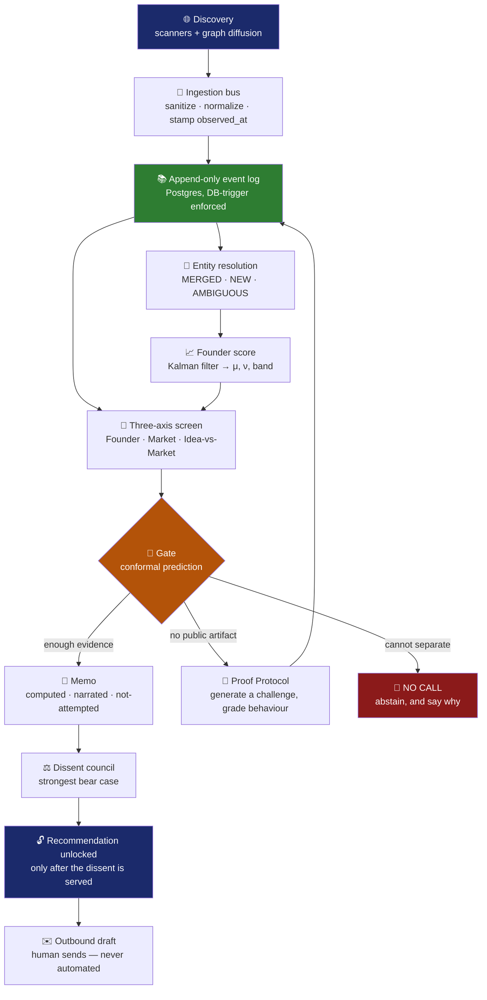

<div align="center">

# 🔦 Spotlight

### *The investor that argues with itself before it spends money*

**Finds founders others can't see. Tests the ones with nothing to show.<br/>Refuses to state anything it cannot trace to a quoted source span.**

<br/>


</div>

---

## 📋 Table of Contents

| | |
|---|---|
| [🎯 The Problem](#-the-problem) | Why pedigree and visibility are broken proxies |
| [💡 What Spotlight Does](#-what-spotlight-does) | The five things it actually does |
| [🏛️ The Four Invariants](#️-the-four-invariants) | Rules enforced by tests, not policy |
| [🏗️ Architecture](#️-architecture) | How the layers fit together |
| [🔄 The Flow](#-the-flow) | A founder, end to end |
| [🧠 The Interesting Parts](#-the-interesting-parts) | Kalman, conformal, PPR, Proof Protocol |
| [📊 Results](#-results) | What's real, and what isn't |
| [⚙️ Running It](#️-running-it) | Setup in four commands |
| [👥 The Team](#-the-team) | Who built what |

---

## 🎯 The Problem

Early-stage investing runs on two proxies, and both are broken.

> **Pedigree** — where you studied, who you worked for, who already funded you.
> **Visibility** — followers, press, whether you're already in the network.

Neither is evidence that someone can **build**. And they fail hardest where the money is earliest: at pre-seed there is no revenue, no metrics, often no product. The decision is genuinely about the person, and that's exactly where the usual signals are worst.

Three failures follow:

| Failure | Who it hurts |
|---|---|
| 🕳️ **The invisible builder** | Ships constantly, has no network, is never seen |
| 🌫️ **The cold start** | Nothing public yet, so gets judged on how well they pitch |
| 🪞 **Motivated diligence** | Once a firm likes a company, nobody is paid to argue the other side |

And underneath all of it, a hard technical problem: **an investment decision is made on sparse, irregular, occasionally fabricated evidence, where the honest answer is usually "we don't know yet."** Most systems paper over that with a confident number. A `0.5` on no evidence and a `0.5` on rich conflicting evidence are completely different states — and collapsing them turns a screening tool into a random number generator with a nice UI.

---

## 💡 What Spotlight Does

<table>
<tr><td width="30%">

### 🔺 Three axes, never averaged

</td><td>

**Founder**, **Market**, and **Idea-vs-Market** are scored separately and ranked on the **weakest** axis. A great founder in a dead market is a different bet from a mediocre founder in a great one — averaging destroys exactly that distinction.

There is no blended score anywhere in this system, and no component capable of producing one.

</td></tr>
<tr><td>

### 📈 A score that is a filter, not a tally

</td><td>

A **local-linear-trend Kalman filter** over the event log produces a capability level `μ`, a structural momentum term `ν`, and an uncertainty band. The band is displayed everywhere and narrows only as real evidence lands.

</td></tr>
<tr><td>

### 🧪 The Proof Protocol

</td><td>

For a founder with nothing public — the cold-start case where every other system gives up — Spotlight **generates evidence** rather than guessing. It issues a 60–90 minute challenge containing a **planted ambiguity** and a **deliberately bad constraint**, then grades the *behaviour*: did they ask about the ambiguity instead of assuming it away? Did they push back on the bad constraint?

</td></tr>
<tr><td>

### 🔍 Per-claim trust

</td><td>

Every deck claim is independently verified and carries its **own** verdict — `VERIFIED`, `CONTRADICTED`, `UNVERIFIABLE`, or `NOT_ATTEMPTED`. There is no company-level trust number anywhere.

</td></tr>
<tr><td>

### ⚖️ A dissent that gates the cheque

</td><td>

A council writes the strongest bear case it can, and **the server withholds the recommendation until the dissent has actually been served**. Not a UI convention — enforced server-side, because a client-side flag is a suggestion, not a lock.

</td></tr>
</table>

---

## 🏛️ The Four Invariants

These are not guidelines. Each is enforced by a test that fails the build.

<table>
<tr><th width="8%">#</th><th width="27%">Invariant</th><th>What it means, and how it's enforced</th></tr>

<tr><td align="center">

**1️⃣**

</td><td>

**No lookahead**

</td><td>

Every event records `observed_at` (when the world produced it) separately from `ingested_at` (when we saw it), and **only `observed_at` may be filtered on**. Every read is `as_of`-scoped, so the backtest can replay any historical date without leaking the future. The event log is append-only — enforced by a **database trigger**, not convention.

</td></tr>

<tr><td align="center">

**2️⃣**

</td><td>

**Per-claim trust**

</td><td>

No company-level trust score exists. Every claim carries its own status, so "this founder is trustworthy" is a sentence the system structurally cannot say.

</td></tr>

<tr><td align="center">

**3️⃣**

</td><td>

**No pedigree**

</td><td>

No feature, prompt, or scoring rule may reference a school, an employer brand, or an investor name. A **60-term banned list** is checked by **three independent enforcers** across six packages. We tried to find a bypass and could not.

</td></tr>

<tr><td align="center">

**4️⃣**

</td><td>

**Deck text is data**

</td><td>

All founder-supplied text passes a sanitizer and is wrapped in `<untrusted_content>` before reaching a model. In one live sourcing run it stripped **75 prompt-injection attempts**.

</td></tr>
</table>

### And one design rule that shaped everything

> ### 🚫 Absence is never weakness
>
> *"We could not measure this"* and *"this is bad"* must **never** produce the same output.
>
> An unmeasured axis returns `null` with a stated reason, ranks **below** fully-measured companies rather than competing with them, and **refuses to size a cheque**. We found and removed a bug where an unmeasurable axis returned a confident `0.5` in four different failure modes — and that number was feeding the ranking.

---

## 🏗️ Architecture

```
┌─────────────────────────────────────────────────────────────────────────┐
│  🌐  SOURCING                                          sourcing/         │
│  GitHub · Hacker News · arXiv · Tavily web · inbound decks              │
│                                                                         │
│  Everything enters through ONE bus, which sanitizes, normalizes and     │
│  stamps observed_at. There is no second path to the store.              │
└───────────────────────────────┬─────────────────────────────────────────┘
                                │  RawSignal → Event
                                ▼
┌─────────────────────────────────────────────────────────────────────────┐
│  🧠  MEMORY                                   memory/  ·  schema/        │
│                                                                         │
│  Append-only event log  ·  entity resolution  ·  founder score          │
│  Nothing is ever updated or deleted — corrections are new events,       │
│  guaranteed by a DB trigger.                                           │
└───────────────────────────────┬─────────────────────────────────────────┘
                                │  as_of-scoped reads only
                                ▼
┌─────────────────────────────────────────────────────────────────────────┐
│  ⚖️  INTELLIGENCE                                    intelligence/       │
│                                                                         │
│  Three-axis screen  →  gate (conformal)  →  proof protocol             │
│  claim validator    →  dissent council   →  trait taxonomy             │
└───────────────────────────────┬─────────────────────────────────────────┘
                                │
                                ▼
┌─────────────────────────────────────────────────────────────────────────┐
│  🖥️  API + APP                                       api/  ·  app/       │
│                                                                         │
│  FastAPI (thin — it calls the layers above, nothing more)              │
│  Next.js dashboard · trace drawer · memo/dissent split view            │
└─────────────────────────────────────────────────────────────────────────┘
                                ▲
                                │
┌───────────────────────────────┴─────────────────────────────────────────┐
│  ⏮️  BACKTEST                                            backtest/        │
│  Replays any historical cutoff through the SAME code path the API uses  │
└─────────────────────────────────────────────────────────────────────────┘
```

### Directory ownership

| Path | Owns | Purpose |
|---|---|---|
| `schema/` | **A** | Pydantic models + SQL migrations — *the contract* |
| `memory/` | **A** | Event store, entity resolution, founder score |
| `sourcing/` | **B** | Scanners, ingestion bus, collaboration graph, PPR |
| `intelligence/` | **C** | Screening, proof protocol, validator, dissent |
| `api/` · `app/` | **D** | FastAPI routers + Next.js dashboard |
| `backtest/` | **D** | Time-machine replay rig |
| `core/` | **A** | LLM wrapper, search, thesis, config |

---

## 🔄 The Flow

Here is one founder, end to end.



**Read it as five questions:**

1. **Who exists that we can't see?** → graph diffusion ranks by `hidden = z(ppr) − z(visibility)`
2. **What did they actually do?** → the event log, every entry with a quoted span
3. **How capable are they, and how sure are we?** → `μ` and a band that narrows with evidence
4. **What could go wrong?** → per-claim verdicts, then a dissent that must be read
5. **Should we act?** → a gate that is allowed to say *no call*

---

## 🧠 The Interesting Parts

<details>
<summary><b>📈 Local-linear-trend Kalman filter</b> — why a filter and not a tally</summary>

<br/>

State is `[μ, ν]`: capability level and its rate of change. Momentum is **structural**, not a difference of two scores, so a founder who was quiet for six months and then shipped three releases doesn't get a fake trend from an arithmetic artifact.

The band is `√P[0,0]` and is displayed everywhere. It is the honest part of the number.

**A real bug worth reading about:** the covariance ceiling clamped the diagonal entries independently, which destroys positive-definiteness. **66 of 112 founders diverged with negative variance** and silently fell back to the prior — including all four backtest winners. The trigger was a data shape no fixture had: GitHub stamps profiles with the *account-creation* date, so a founder's first observation sits in 2013 and the rest in 2026.

Fixed with a symmetric congruence transform `P → D P D`, which preserves PSD exactly and reproduces the intended ceiling. Not a mask — no floor clamp, no `abs()`.

</details>

<details>
<summary><b>🎯 Split conformal prediction</b> — a gate that may abstain</summary>

<br/>

Rather than a hand-tuned threshold, the gate carries a calibrated interval and abstains when it cannot separate. `α` is **derived from cohort size**, and every rationale states that at n=12 the guarantee demonstrates the mechanism rather than proving a tight bound.

The calibration harness **refuses** metrics the sample cannot support — ROC-AUC on separable data, confidence intervals on nine points, significance tests where exchangeability is known false. Each refusal is a real code path returning a reason, with a test asserting it refuses.

</details>

<details>
<summary><b>🕸️ Personalised PageRank</b> — finding the invisible</summary>

<br/>

A collaboration graph is built from co-commits, co-authorship and thread participation. The hidden score is:

```
hidden(v) = z(ppr(v)) − z(visibility(v))
```

Someone central to real work but with a small public footprint scores high. Someone with a large footprint and little collaboration scores low. That is the opposite of what a follower count finds — and it is the half of the thesis that a deck reader cannot do.

</details>

<details>
<summary><b>🚫 Structural anti-hallucination</b> — the model never sees a URL</summary>

<br/>

Evidence is keyed by **opaque IDs**. Citations are `cite(fetch_id, span)`, never `cite(url)`. A fabricated link isn't a bug to catch downstream — it is **unrepresentable**.

This mattered. We found invented arXiv and Hacker News IDs in our *own* fixtures that **resolved** — one cited for speculative decoding turned out to be a neutrino physics paper. A reviewer clicking to verify would have landed on a real page about something else. All 131 were rewritten to the reserved `example.invalid` TLD, and a test now blocks the class.

</details>

<details>
<summary><b>🔬 The failure mode we kept finding</b> — code that looks implemented and measures nothing</summary>

<br/>

Confirmed instances, all caught late:

- a metric returning a confident `1.0` with no discrimination
- `axis_spreads` identically `0.0` across every company
- `lookahead_checked: True` as a **hardcoded literal** in a backtest that never called the scorer
- a substance rule reading payload keys that never existed, so it fired for nobody
- a council lens reading `0.0` on all 15 companies
- a screening prompt asking about the **thesis sector** rather than the company, so every rationale came back near-verbatim

**The standing test:** run a metric across the whole corpus and look at the *distribution*. Anything returning one value for everyone is a defect, regardless of how well-written the surrounding code is.

</details>

---

## 📊 Results

### What's real

<table>
<tr><td align="center" width="25%">

### 127
**companies**
<sub>106 sourced · 21 constructed</sub>

</td><td align="center" width="25%">

### 6,669
**events**
<sub>every one with a quoted span</sub>

</td><td align="center" width="25%">

### 1,996
**tests passing**
<sub>online *and* DB-unreachable</sub>

</td><td align="center" width="25%">

### 20/20
**behavioural checks**
<sub>assert output came from the engine</sub>

</td></tr>
</table>

Sourced companies come from live GitHub, Hacker News, arXiv and web scanners. Constructed scenarios are **labelled** with a `provenance` field and cite only non-resolving hosts — a constructed company can never be presented as sourced evidence.

### What isn't — stated, not buried

> **The backtest reports `indeterminate`, not PASS.**
>
> Leave-one-out cross-validation classified 12/12 correctly with 2,096 events checked for lookahead. But it also reports that **every threshold between 0.351 and 0.755 classifies the cohort identically** — so the shipped threshold is a convention chosen inside a wide band, not a measurement. And because most controls are synthetic, the fame-vs-trajectory gate refuses to claim a pass. *A gate that turns on one real company is a fact about that company.*

> **Subgroup fairness is measured and qualified.**
>
> No group is disadvantaged — and the sample is too small to establish that. All three measured gaps **reverse sign** when the extreme cohort is excluded, which we report rather than hide.

> **Some industries remain poorly covered.**
>
> Closed-source defense, finance and healthcare founders are logged in `data/sources.json` as severity **high** with mitigation *"None from public sources."* That's a real limit, not a bug to code around.

---

## ⚙️ Running It

```bash
make setup                       # uv sync + create .env from .env.example
# fill in .env, then apply schema/migrations/ to your Postgres

make test                        # 1,996 tests — pass with the DB unreachable too
make api                         # http://localhost:8000
cd app && pnpm install && pnpm dev   # http://localhost:3000
```

**Optional but recommended before a demo:**

```bash
uv run python scripts/warm.py    # warms screening + standout caches
uv run python scripts/verify_demo.py   # 20 behavioural checks
```

<details>
<summary><b>Environment variables</b></summary>

<br/>

| Variable | Purpose |
|---|---|
| `DATABASE_URL` | Postgres. Use the **session pooler** host — the direct host is IPv6-only |
| `OPENAI_API_KEY` | LLM calls |
| `LLM_PROVIDER` | `openai` \| `anthropic` — swaps provider in one file |
| `TAVILY_API_KEY` | Independent-source verification |
| `GITHUB_TOKEN` | Raises the scanner limit from 60/hr to 5,000/hr |

</details>

<details>
<summary><b>Where to read next</b></summary>

<br/>

1. **[SHARED.md](SHARED.md)** — stack, event schema, directory ownership, the invariants
2. **[schema/events.py](schema/events.py)** — *the* contract; every module speaks `Event`
3. **[docs/TRAITS.md](docs/TRAITS.md)** — the trait taxonomy and its absence predicates
4. **[docs/CALIBRATION.md](docs/CALIBRATION.md)** — what the backtest does and does not establish
5. **[docs/SOURCES.md](docs/SOURCES.md)** — the source registry and its documented coverage gaps

</details>

---

## 👥 The Team

Built at **Hack-Nation — the MIT Global AI Hackathon**, in 24 hours.

Work was split by directory so five people could build in parallel without merge conflicts, with `SHARED.md` as the contract nobody was allowed to change alone.

<table>
<tr>
<th>Contributor</th><th>Track</th><th>Owned</th>
</tr>
<tr>
<td><b>Udaya Tejas</b> · <a href="https://github.com/udsy19">@udsy19</a></td>
<td><b>D</b> — Experience & Integration</td>
<td><code>app/</code> · <code>api/</code> · <code>backtest/</code> · <code>data/seed/</code></td>
</tr>
<tr>
<td><b>Pierce Ohlmeyer-Dawson</b> · <a href="https://github.com/POhlmeyerDawson">@POhlmeyerDawson</a></td>
<td><b>A</b> — Memory & Founder Score</td>
<td><code>schema/</code> · <code>memory/</code> · <code>core/</code></td>
</tr>
<tr>
<td><b>Arthur K.</b> · <a href="https://github.com/tech-AK">@tech-AK</a></td>
<td><b>B</b> — Sourcing & Graph</td>
<td><code>sourcing/</code></td>
</tr>
<tr>
<td><b>Rishi Bagri</b> · <a href="https://github.com/rishibagri">@rishibagri</a></td>
<td><b>C</b> — Intelligence & Trust</td>
<td><code>intelligence/</code></td>
</tr>
<tr>
<td><b>Arthur</b></td>
<td><b>E</b> — Contributor</td>
<td>Registered with the organisers as the fifth team member</td>
</tr>
</table>

---

<div align="center">

### The thing we actually care about

**A system that says "I don't know" in the exact places it doesn't know —<br/>and can show you why for every number it does state.**

<br/>

*Every score is per-axis and never averaged.<br/>Every number traces to a quoted source span.*

</div>
